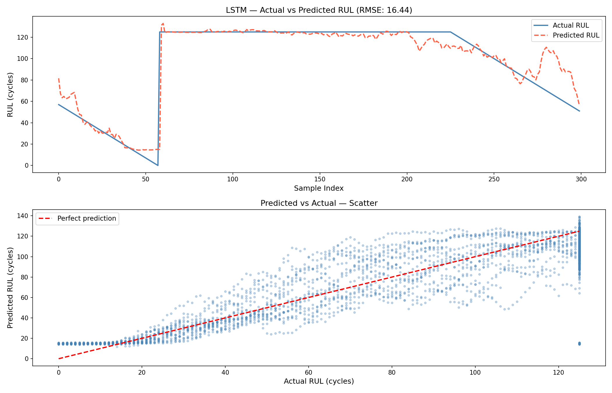
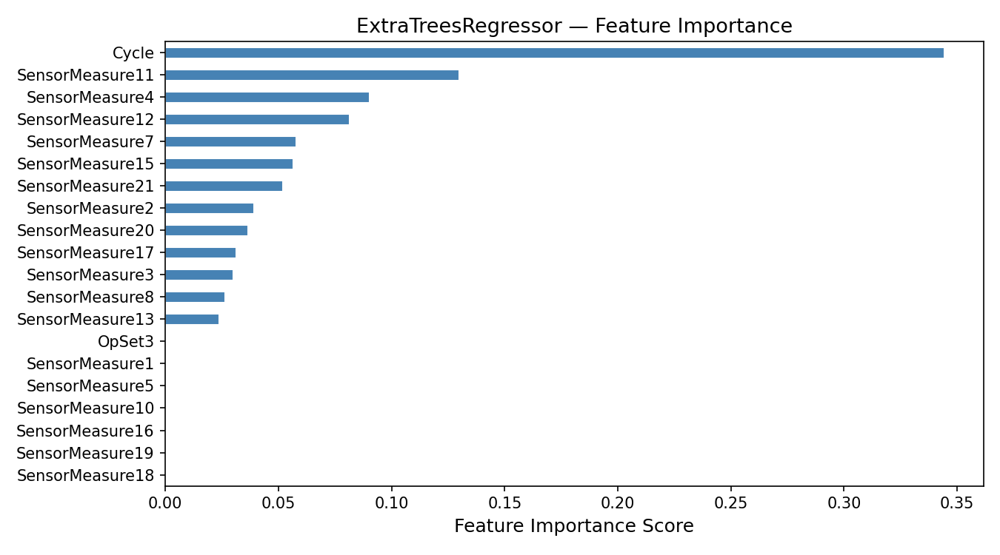
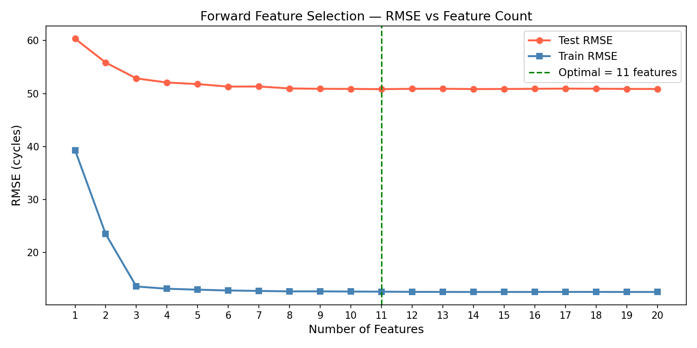
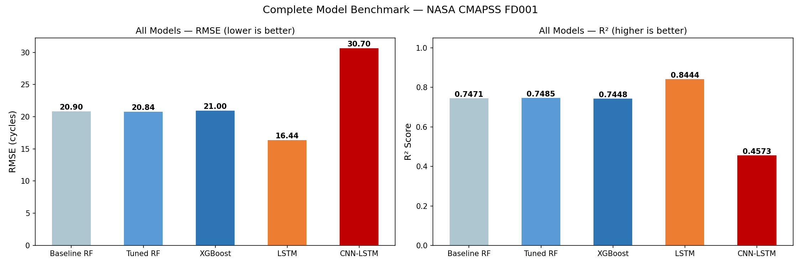
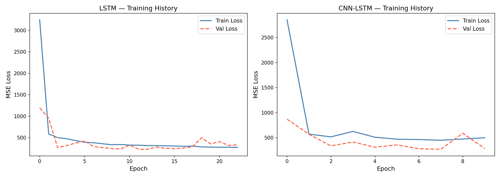

# Turbofan Engine RUL Prediction — NASA CMAPSS

<p align="center">
  
</p>

<p align="center">
  
  
  
  
  
</p>

---

## Overview

An end-to-end **predictive maintenance pipeline** on the NASA CMAPSS dataset. Two tasks:

- 🔵 **Classification** — Label each engine cycle as Healthy / Degrading / Critical
- 🔴 **Regression** — Predict exact Remaining Useful Life (RUL) in cycles

**Best result: RMSE 15.38 cycles — within published research paper benchmarks.**

---

## Dataset — NASA CMAPSS

Simulates a fleet of aircraft turbofan engines monitored cycle-by-cycle until failure.
Each row = one cycle snapshot of one engine (sensor readings + operating conditions).

```
Engine lifecycle:  Healthy ──► Degradation ──► Fault grows ──► FAILURE
```

| Dataset | Engines | Conditions | Fault Modes | Difficulty |
|---------|:-------:|:----------:|:-----------:|:----------:|
| FD001 | 100 | 1 | HPC Degradation | Easy |
| FD002 | 260 | 6 | HPC Degradation | Medium |
| FD003 | 100 | 1 | HPC + Fan | Medium |
| FD004 | 248 | 6 | HPC + Fan | Hard |

- **Training data** → full run-to-failure trajectories → RUL = `failure_cycle − current_cycle`
- **Test data** → trajectories cut before failure → model must predict RUL from partial history

---

## 🔵 Task 1 — Health State Classification

Engine health discretized into 3 classes using **Life Ratio (LR = Cycle / EOL)**:

```
LR ≤ 0.60           →  0  (Healthy)
0.60 < LR ≤ 0.80   →  1  (Degrading)
LR > 0.80           →  2  (Critical)
```

All 4 datasets combined → **160,359 rows** → trained Random Forest with RandomizedSearchCV tuning.

| Model | Result |
|-------|--------|
| Baseline RF | Strong baseline |
| Tuned RF (n=300, depth=20, samples=0.4) | **Best accuracy** |

---

## 🔴 Task 2 — RUL Regression

### Pipeline

```
Raw Data → Preprocessing → EDA → Feature Selection → ML Models → Deep Learning → Evaluation
```

### Key Design Decisions

| Decision | Why |
|----------|-----|
| **RUL capped at 125 cycles** | Early engine life shows no degradation in sensors — capping removes noise and focuses the model on the degradation phase. Standard in CMAPSS literature. |
| **shuffle=False in train/test split** | Engine data is time-series — shuffling breaks temporal order and causes data leakage |
| **MinMaxScaler fit on train only** | Prevents test data statistics from leaking into training |
| **Sequence length = 30 timesteps** | Gives LSTM enough history to detect degradation trends without excessive padding |

### Feature Selection — 25 → 11 Features

Three-stage process to remove noise and keep only informative sensors:

```
Stage 1 — Correlation filter    →  drop features with |corr| < 0.5 with RUL  (removed 12)
Stage 2 — ExtraTreesRegressor   →  rank remaining features by importance
Stage 3 — Forward selection     →  add features one by one, stop when RMSE plateaus
                                    Result: 11 optimal features
```

<p align="center">
  
  <br><em>ExtraTreesRegressor Feature Importance Ranking</em>
</p>

<p align="center">
  
  <br><em>Forward Selection — RMSE plateaus at 11 features</em>
</p>

### Model Progression

Each model was chosen to answer a specific question:

| Model | Why used |
|-------|----------|
| **Baseline RF** | Establish ML ceiling without tuning |
| **Tuned RF** | Check if hyperparameter tuning helps ML |
| **XGBoost** | Compare gradient boosting vs bagging |
| **LSTM** | Capture temporal degradation patterns — ML cannot do this |
| **CNN-LSTM** | Check if local pattern extraction (CNN) improves LSTM |
| **BiLSTM** | Process sequence in both directions — future context helps RUL |
| **Attention BiLSTM** | Learn which timesteps matter most — not all cycles are equally informative |

### Results

| Model | Type | RMSE | MAE | R² |
|-------|------|:----:|:---:|:--:|
| Baseline RF | ML | 20.90 | — | 0.7471 |
| Tuned RF | ML | 20.84 | — | 0.7485 |
| XGBoost | ML | 21.00 | — | 0.7448 |
| LSTM | DL | 16.44 | 10.91 | 0.8444 |
| CNN-LSTM | DL | 17.53 | 12.33 | 0.8231 |
| BiLSTM | DL | 16.39 | 11.43 | 0.8453 |
| **Attention BiLSTM** | **DL** | **15.38** | **9.72** | **0.8638** |

> 🏆 Attention BiLSTM — **26% RMSE improvement** over best ML model


### vs Published Research (FD001)

| Approach | Typical RMSE |
|----------|:---:|
| Tuned ML | 20–25 |
| Standard LSTM | 16–18 |
| **This project** | **15.38** ✅ |
| Top papers | 12–14 |

<p align="center">
  
  <br><em>All 7 Models Benchmarked</em>
</p>

<p align="center">
  
  <br><em>Training and Validation Loss — LSTM and CNN-LSTM</em>
</p>

---

## Attention BiLSTM Architecture

```
Input (30 timesteps × 11 features)
    │
    ▼
BiLSTM(64) + BatchNorm + Dropout(0.3)   — bidirectional: sees past AND future context
    │
    ▼
BiLSTM(32) + BatchNorm + Dropout(0.2)
    │
    ▼
Attention Layer   — assigns higher weight to cycles where degradation is visible
    │
    ▼
Dense(32) → Dense(16) → Dense(1)        — predicted RUL
```

---

## Tech Stack

`Python 3.11` · `TensorFlow / Keras` · `Scikit-learn` · `XGBoost` · `Pandas` · `NumPy` · `Matplotlib` · `Seaborn`

---

## References

1. Saxena et al. (2008). *Damage propagation modeling for aircraft engine run-to-failure simulation.* PHM 2008.
2. Heimes, F. O. (2008). *Recurrent neural networks for remaining useful life estimation.* PHM 2008.
3. Li, X., Ding, Q., & Sun, J. Q. (2018). *Remaining useful life estimation using deep convolution neural networks.* Reliability Engineering & System Safety.
