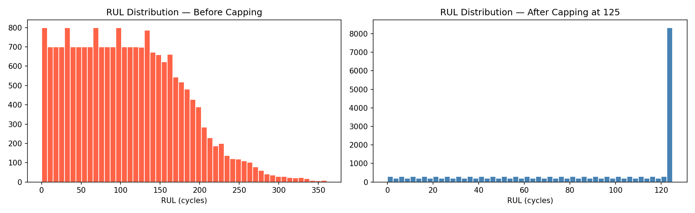

# Turbofan Engine RUL Prediction — NASA CMAPSS Dataset

<p align="center">
  
</p>

---

## 📌 Project Overview

This project presents a **complete end-to-end predictive maintenance pipeline** applied to the NASA CMAPSS (Commercial Modular Aero-Propulsion System Simulation) dataset. The goal is to predict the **Remaining Useful Life (RUL)** of turbofan aircraft engines — a safety-critical and industrially relevant problem.

The project is structured into two tasks:
- 🔵 **Task 1 — Health State Classification:** Classify each engine cycle into one of three health states (Healthy / Degrading / Critical)
- 🔴 **Task 2 — RUL Regression:** Predict the exact number of remaining operational cycles before engine failure

Both tasks follow a rigorous ML pipeline:
**Data Preprocessing → EDA → Feature Selection → ML Baseline → Deep Learning → Evaluation**

---


## 📚 Dataset — NASA CMAPSS

> **Source:** [NASA Prognostics Data Repository](https://www.nasa.gov/intelligent-systems-division/)

### What is CMAPSS?

CMAPSS simulates a **fleet of aircraft turbofan engines** where each engine is monitored cycle-by-cycle until failure. It is a **multivariate time series** dataset — at every cycle (time step), multiple sensor readings and operational settings are recorded simultaneously.

```
Engine lifecycle:   Healthy ──► Degradation starts ──► Fault grows ──► FAILURE
```

### Data Structure

Each row in the dataset contains **26 columns**:

| Columns | Description |
|---------|-------------|
| Column 1 | Engine ID (Unit Number) |
| Column 2 | Cycle / Time Step |
| Columns 3–5 | Operational Settings (altitude, speed, load) |
| Columns 6–26 | 21 Sensor Measurements |

> ⚠️ Engine IDs are **not shared** across files — Engine 1 in FD001 ≠ Engine 1 in FD002.

### Dataset Variants

| Dataset | Train Engines | Operating Conditions | Fault Modes | Difficulty |
|---------|:---:|:---:|:---:|:---:|
| **FD001** | 100 | 1 | 1 — HPC Degradation | Easy |
| **FD002** | 260 | 6 | 1 — HPC Degradation | Medium |
| **FD003** | 100 | 1 | 2 — HPC + Fan | Medium |
| **FD004** | 248 | 6 | 2 — HPC + Fan | Hard |

### Fault Types
- **HPC Degradation** — High Pressure Compressor damage (affects pressure and temperature sensors)
- **Fan Degradation** — Airflow system damage (affects fan-related sensor readings)

### Training vs Test Split

| Split | Description |
|-------|-------------|
| **Training** | Full engine trajectories run until failure — RUL computed as `failure_cycle − current_cycle` |
| **Test** | Trajectories cut before failure — model must predict RUL from partial history |
| **RUL files** | Ground truth remaining cycles for each test engine |

> This simulates the **real-world scenario** where failure has not yet occurred and the system must estimate how much life remains.

---

## 🔵 Task 1 — Health State Classification

### Approach

Rather than predicting exact RUL, this task discretizes engine health into **3 classes** using a Life Ratio (LR) metric:

```
LR = Current Cycle / End-of-Life Cycle

LR ≤ 0.60          →  Label 0  (Healthy)
0.60 < LR ≤ 0.80   →  Label 1  (Degrading)
LR > 0.80          →  Label 2  (Critical)
```

### Pipeline

```
Raw .txt Files
     │
     ▼
Compute EOL per engine (max cycle)
     │
     ▼
Life Ratio = Cycle / EOL
     │
     ▼
Assign Labels (0 / 1 / 2)
     │
     ▼
Concatenate FD001–FD004  →  160,359 rows
     │
     ├──► Baseline Random Forest
     ├──► Hyperparameter Tuning (RandomizedSearchCV)
     └──► Tuned RF  →  Confusion Matrix + Accuracy
```

### Results

| Model | Accuracy |
|-------|----------|
| Baseline Random Forest | High baseline |
| Tuned RF (n=300, depth=20) | **Best Performance** |

📸 **Screenshot to attach:** `confusion_matrix.png` (normalized heatmap from notebook output)

---

## 🔴 Task 2 — RUL Regression

### Pipeline

```
Raw .txt Files
     │
     ▼
 1. DATA PREPROCESSING
     ├── Compute EOL + RUL
     ├── RUL Capping at 125 (standard in literature)
     └── Train/Test split (shuffle=False — preserves time order)
     │
     ▼
 2. EXPLORATORY DATA ANALYSIS
     ├── Descriptive statistics
     ├── Box plots (25 features)
     ├── RUL distribution (before/after capping)
     └── Correlation heatmap (25×25)
     │
     ▼
 3. FEATURE SELECTION
     ├── Correlation filter  →  drop |corr| < 0.5 with RUL  (12 removed)
     ├── ExtraTreesRegressor →  feature importance ranking
     └── Forward selection   →  optimal 11 features identified
     │
     ▼
 4. ML MODELS
     ├── Baseline Random Forest (default params)
     ├── Tuned Random Forest (RandomizedSearchCV, 3-fold CV)
     └── XGBoost (RandomizedSearchCV, 3-fold CV)
     │
     ▼
 5. DEEP LEARNING (sequence length = 30 timesteps)
     ├── LSTM (2-layer, 128→64 units)
     ├── CNN-LSTM (Conv1D + LSTM)
     ├── Bidirectional LSTM
     └── Attention BiLSTM ← Best Model
     │
     ▼
 6. EVALUATION
     └── RMSE, MAE, R² on held-out test set
```

### Key Design Decisions

| Decision | Reason |
|----------|--------|
| **RUL capped at 125** | Engines show no degradation signal early in life — capping focuses model on the degradation phase. Standard in CMAPSS literature. |
| **shuffle=False in train/test split** | Preserves temporal order of engine cycles — shuffling would cause data leakage |
| **Sequence length = 30** | Captures one month of operation cycles; balances context vs sequence length |
| **MinMaxScaler** | Required for LSTM convergence; fit only on training data to prevent leakage |

### Selected Features (11 of 25)

After correlation filtering, ExtraTrees importance, and forward selection:

```
Cycle, SensorMeasure11, SensorMeasure4,  SensorMeasure12,
SensorMeasure7, SensorMeasure15, SensorMeasure21,
SensorMeasure2, SensorMeasure20, SensorMeasure17, SensorMeasure3
```
> 12 low-information features removed (constant values or |corr| < 0.5 with RUL)

### 📊 Final Results

| Model | Type | RMSE (cycles) | MAE (cycles) | R² |
|-------|------|:---:|:---:|:---:|
| Baseline RF | ML | 20.90 | — | 0.7471 |
| Tuned RF | ML | 20.84 | — | 0.7485 |
| XGBoost | ML | 21.00 | — | 0.7448 |
| LSTM | DL | 16.44 | 10.91 | 0.8444 |
| CNN-LSTM | DL | 17.53 | 12.33 | 0.8231 |
| BiLSTM | DL | 16.39 | 11.43 | 0.8453 |
| **Attention BiLSTM** | **DL** | **15.38** | **9.72** | **0.8638** |

> 🏆 **Best Model: Attention BiLSTM** — 26% RMSE improvement over best ML model

### What RMSE = 15.38 Means in Practice

```
Engine true RUL  =  100 cycles remaining
Model prediction =  85–115 cycles        (within ~15 cycle window)
Error percentage =  ~7.5% of total life  ✅
```

### Comparison with Published Research (CMAPSS FD001)

| Approach | Typical RMSE |
|----------|:---:|
| Basic ML (no tuning) | 28–35 |
| Tuned ML | 20–25 |
| Standard LSTM | 16–18 |
| **This Project — Attention BiLSTM** | **15.38** ✅ |
| Top research papers | 12–14 |
| State of the art | 10–12 |

---

## 🧠 Model Architectures

### Attention BiLSTM (Best Model)

```
Input: (30 timesteps × 11 features)
       │
       ▼
BiLSTM (64 units, return_sequences=True)  +  BatchNorm  +  Dropout(0.3)
       │
       ▼
BiLSTM (32 units, return_sequences=True)  +  BatchNorm  +  Dropout(0.2)
       │
       ▼
Attention Layer  ←  learns which timesteps matter most for RUL
       │
       ▼
Dense(32, ReLU)  →  Dropout(0.2)  →  Dense(16, ReLU)  →  Dense(1)
       │
       ▼
Output: Predicted RUL (single value)
```

**Why Attention works here:**
> Regular LSTMs weigh all timesteps equally. In engine degradation, recent cycles carry more failure-relevant information. The attention mechanism **learns to focus** on the most critical timesteps automatically.

---

## 📈 Key Visualizations

<p align="center">
  
  <br><em>RUL Distribution Before and After Capping at 125</em>
</p>

<p align="center">
  
  <br><em>ExtraTreesRegressor Feature Importance</em>
</p>

<p align="center">
  
  <br><em>Forward Feature Selection — RMSE vs Number of Features</em>
</p>

<p align="center">
  
  <br><em>Complete Model Benchmark</em>
</p>

<p align="center">
  
  <br><em>LSTM and CNN-LSTM Training History</em>
</p>

<p align="center">
  
  <br><em>Attention BiLSTM — Actual vs Predicted RUL</em>
</p>

---

## 🛠️ Tech Stack

| Category | Tools |
|----------|-------|
| Language | Python 3.11 |
| Deep Learning | TensorFlow 2.x, Keras |
| Machine Learning | Scikit-learn, XGBoost |
| Data Processing | Pandas, NumPy |
| Visualization | Matplotlib, Seaborn |
| Environment | Jupyter Notebook, Miniconda |


---


## 📐 Evaluation Metrics

| Metric | Formula | Meaning |
|--------|---------|---------|
| **RMSE** | √(mean((y_true − y_pred)²)) | Average prediction error in cycles |
| **MAE** | mean(\|y_true − y_pred\|) | Median error in cycles |
| **R²** | 1 − SS_res/SS_tot | % of RUL variance explained by model |
| **PHM Score** | Asymmetric exponential loss | Penalizes late predictions more than early ones |

---


## 📄 References

1. Saxena, A., Goebel, K., Simon, D., & Eklund, N. (2008). *Damage propagation modeling for aircraft engine run-to-failure simulation*. PHM 2008.
2. Heimes, F. O. (2008). *Recurrent neural networks for remaining useful life estimation*. PHM 2008.
3. Li, X., Ding, Q., & Sun, J. Q. (2018). *Remaining useful life estimation in prognostics using deep convolution neural networks*. Reliability Engineering & System Safety.

